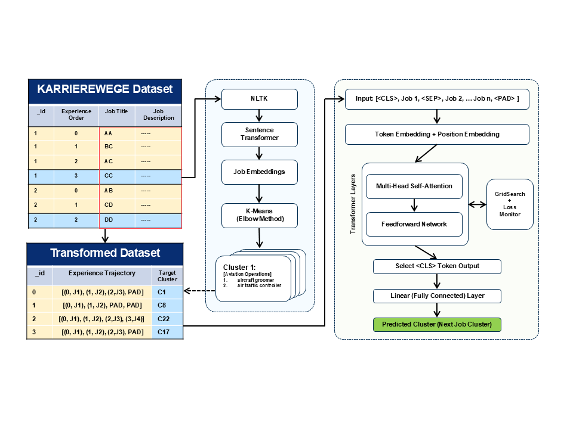

# QTM-347 Project

## Career Path Analysis and Prediction
This project uses machine learning techniques to analyze and predict career trajectories based on job history data.

## Goal of this Project
We want to provide a machine learning solution that helps identify the most likely next occupation or career move based on past experiences.

## Application & Motivation
- Why Transformer? A Transformer can model the full sequence of past jobs to predict the next role more accurately
- Better predictions could inform career-planning tools, HR systems, and personalized learning recommendations

## Pipeline


### Clustering Process:
- First stack job title vector with job description vector (vectors obtained using the sentence transformer)
- Second, we apply the K-Means clustering
- The optimized resulted is shown in the table below:
  
### Clustering Example:
| **Cluster id** | **Cluster Title**| **Example Job Titles**|
|----------------|------------------------------------------------|------------------------------------------------------------------------------------------------------------|
| 14             | Scientific Research and Natural Sciences       | anthropologist; astronomer; biochemical engineer; biochemist; ...|
| 29             | Education, Teaching, and Training Professionals| assistant lecturer; career guidance advisor; digital literacy teacher; drama teacher; driving instructor; ...|
| 0              | Finance and Business Consulting                | actuarial consultant; business coach; business consultant; business economics researcher; business manager; ...|
| ...            | ...                                            | ...                                                                                                        |


**Total Cluster Count: 33**, each containing around 25~50 related job titles


## Git Repo Structure
- `code/career_data_utils.py`: Utility functions for processing career data
- `code/Karrierewege_plus_transformer_v2.py`: Transformer-based model implementation
- `code/lstm_code_v3.ipynb`: LSTM model implementation notebook
- `models/best_career_transformer_model_clustered.pth`: Trained transformer model checkpoint
- `results/cluster_assignments.txt`: Results from job clustering analysis

## Getting Started

### Setup
1. Clone this repository
2. Install required packages using pip:
   ```
   pip install -r requirements.txt
   ```
3. Run the models using the provided scripts or notebooks:
   ```
   # To run the transformer model:
   python code/Karrierewege_plus_transformer_v2.py
   
   # To use the LSTM model, open the notebook
   jupyter notebook code/lstm_code_v3.ipynb
   ```
   
## Models
The project implements and compares two main approaches:
1. **Transformer-based model**: For sequence modeling of career paths
2. **LSTM model**: For sequential prediction of career transitions

## Results
### Transformer Model Performance
- Lowest validation loss (tuning): 3.0444
- Test loss: 3.0047
- Test accuracy: 0.2284

### Best Hyperparameters
- Transformer layers: 1
- Attention heads: 2
- Batch size: 32
- Learning rate: 0.0010

**Note:** Model performance metrics and visualizations can be found in the corresponding notebook and log files.

## Case Study:
### Input ['research assistant', 'doctoral researcher', 'postdoctoral researcher'] as a sequence:
- Cluster 14 (Confidence: 0.4919): Scientific Research & Natural Science
- Cluster 29 (Confidence: 0.1388): Education, Teaching, and Training Professionals
- Cluster 17 (Confidence: 0.1094): Data, Law, and Information Security
- Cluster 21 (Confidence: 0.0334): Cultural Heritage and Museum Professions
- Cluster 0 (Confidence: 0.0260): Finance and Business Consulting

### Input ['construction laborer', 'metal fabricator'] as a sequence:
- Cluster 1 (Confidence: 0.2233): Construction and Trade Technicians 
- Cluster 15 (Confidence: 0.1437): Industrial Machinery and Production Operators
- Cluster 12 (Confidence: 0.0761): ICT and Infrastructure Engineering
- Cluster 19 (Confidence: 0.0733): Construction, Real Estate, and Building Trades
- Cluster 16 (Confidence: 0.0633): Transport and Logistics Coordination

### Input ['kitchen assistant', 'warehouse worker'] as a sequence:
- Cluster 24 (Confidence: 0.1302): Culinary Arts and Hospitality Services 
- Cluster 7 (Confidence: 0.0884): Retail and Logistics Operations 
- Cluster 26 (Confidence: 0.0710): Accounting, Finance, and Recordkeeping 
- Cluster 10 (Confidence: 0.0571): Office, Administrative, and Customer Service Roles 
- Cluster 6 (Confidence: 0.0469): Media, Communication, and Publishing 


### Input ['administrative assistant', 'logistics coordinator'] as a sequence:
- Cluster 16 (Confidence: 0.1650): Transport and Logistics Coordination 
- Cluster 6 (Confidence: 0.0954):  Media, Communication, and Publishing 
- Cluster 7 (Confidence: 0.0628): Retail and Logistics Operations 
- Cluster 30 (Confidence: 0.0540): Aviation Operations and Flight Services 
- Cluster 31 (Confidence: 0.0443): Industrial Process Engineering and Energy 


### Input ['retail sales associate', 'retail support staff', 'inventory coordinator'] as a sequence:
- Cluster 7 (Confidence: 0.1370): Retail and Logistics Operations 
- Cluster 14 (Confidence: 0.1041): Scientific Research and Natural Sciences 
- Cluster 10 (Confidence: 0.0849): Office, Administrative, and Customer Service Roles 
- Cluster 29 (Confidence: 0.0662): Education, Teaching, and Training Professionals 
- Cluster 5 (Confidence: 0.0575): Marketing, Sales, and Business Development

**Note:** The results above come from our transformer model. Please refer to the ``code`` section for code details. 

## Conclusion of our Experiment
- The transformer-based sequence model is effective for next-job prediction
- Achieves relatively accurate performance on core career categories
  
### Limitations:
- Data sparsity: Too many job categories will lower our prediction accuracy 
- K-Means clustering might lead to biases
- Randomness: Some people switch jobs not inconsistently, factors such as the economy and politics might influence one’s decision as well.

## Contributors
- Nate Hu, Victor Ji, Tom Suo, Max Jiang

## References
```
@article{senger2024karrierewege,
  title={KARRIEREWEGE: A Large Scale Career Path Prediction Dataset},
  author={Senger, Elena and Campbell, Yuri and Van Der Goot, Rob and Plank, Barbara},
  journal={arXiv preprint arXiv:2412.14612},
  year={2024}
}
```
